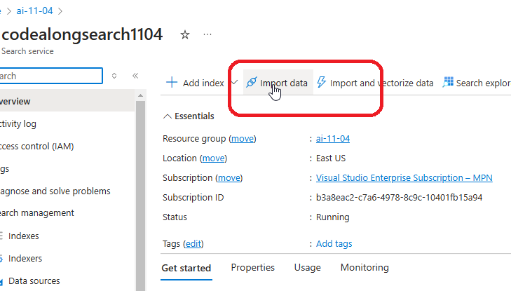
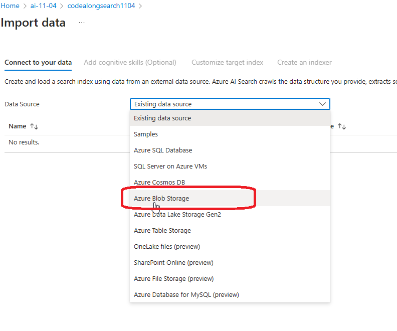
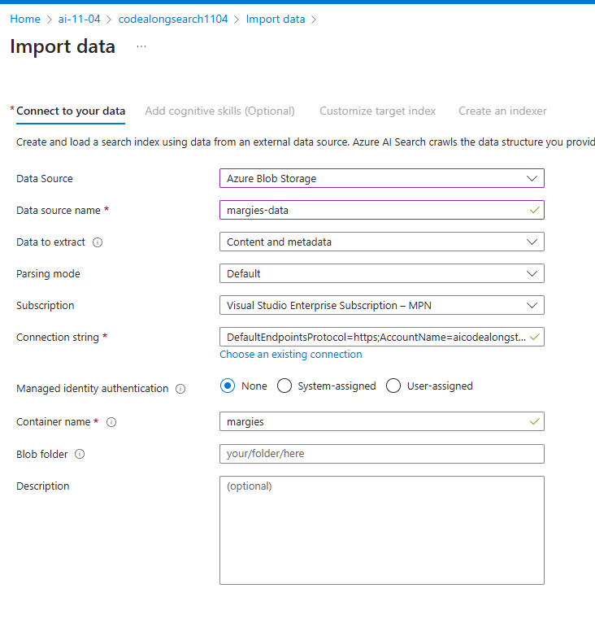
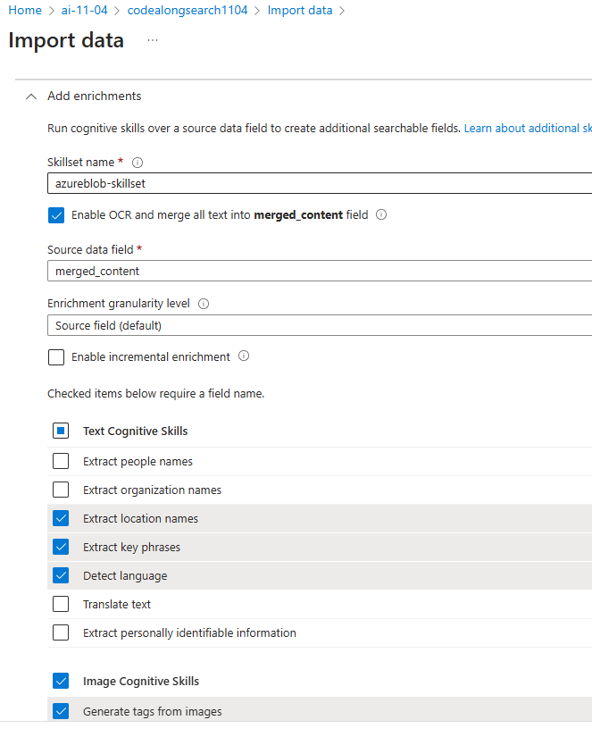
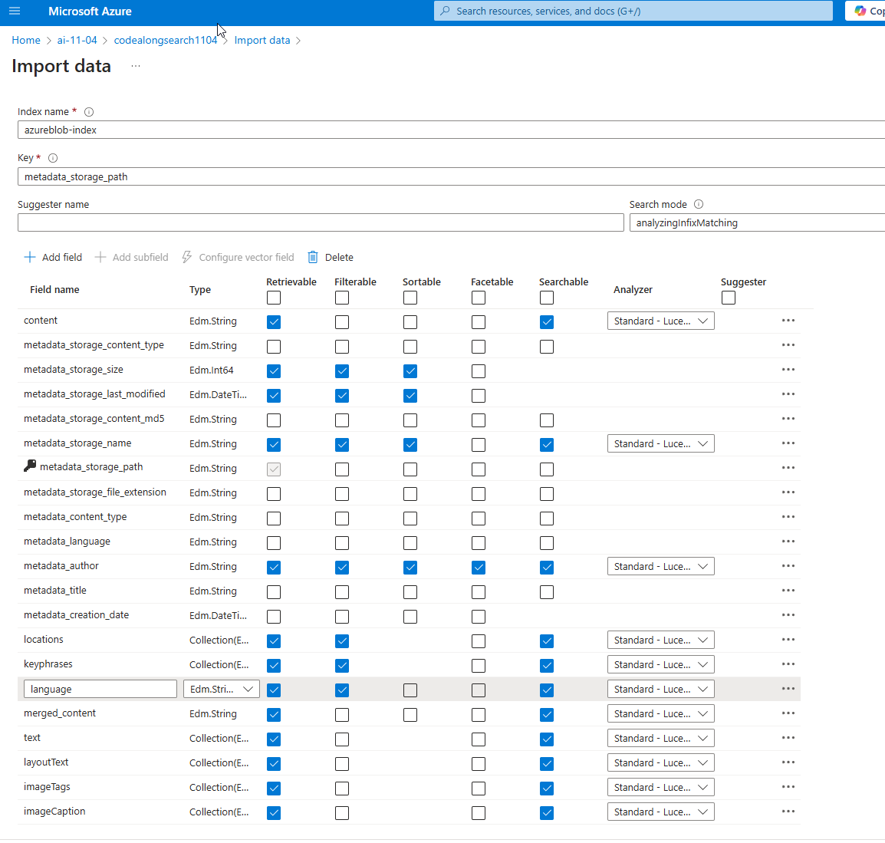
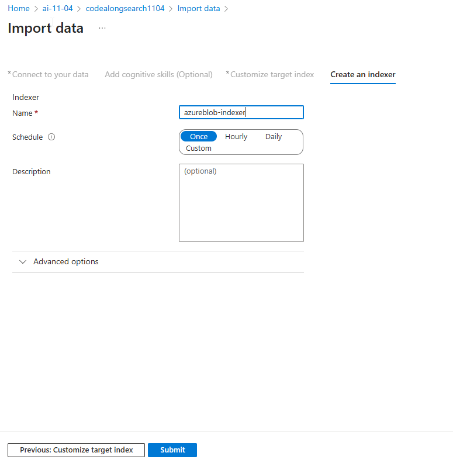
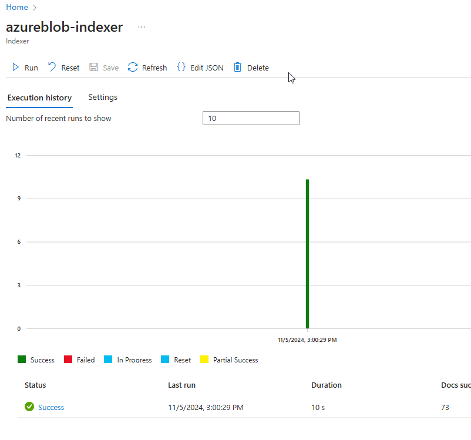
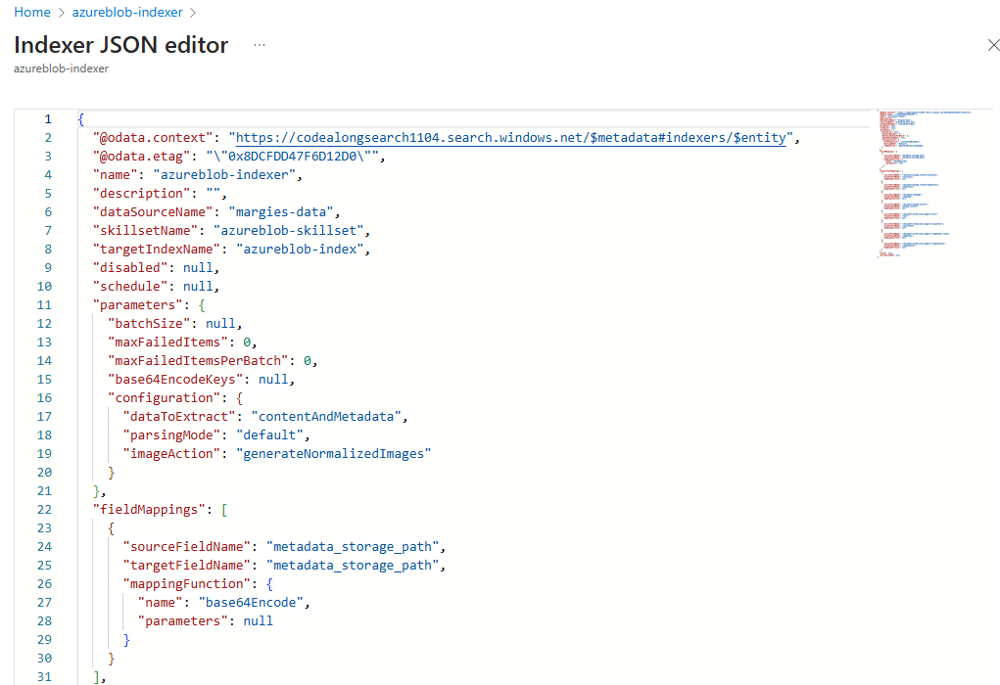
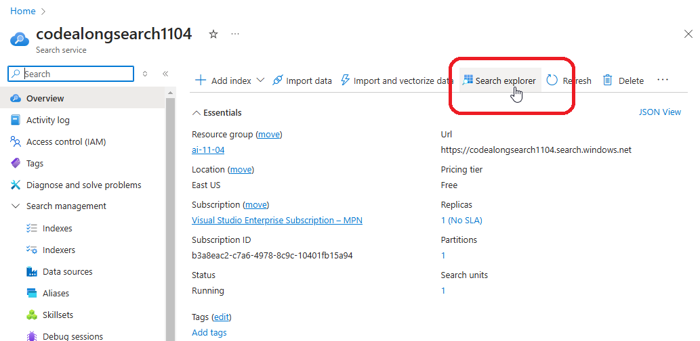
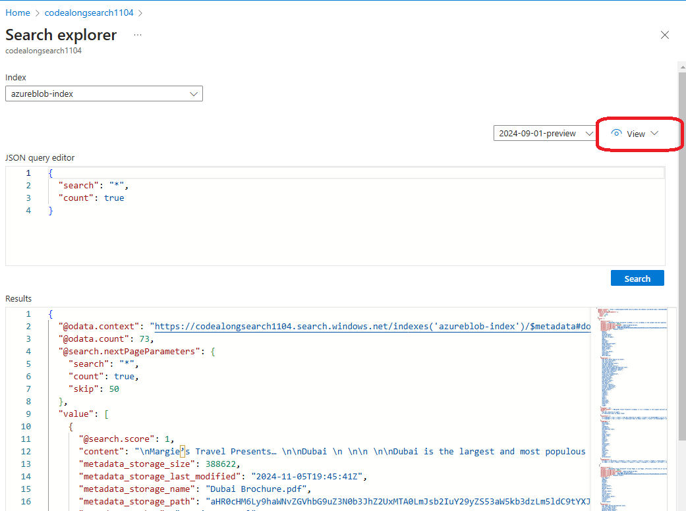

# index the documents












## Note

If you're interested in learning more about Searchable, Filterble, Facetable, Sortable, and Retrievable, check [this page](./index-attributes.md)











try some different queries:

```
 {
   "search": "New York",
   "count": true,
   "select": "metadata_storage_name,keyphrases"
 }
```

```
{
   "search": "New York",
   "count": true,
   "select": "metadata_storage_name",
   "filter": "metadata_author eq 'Reviewer'"
 }
 ```
