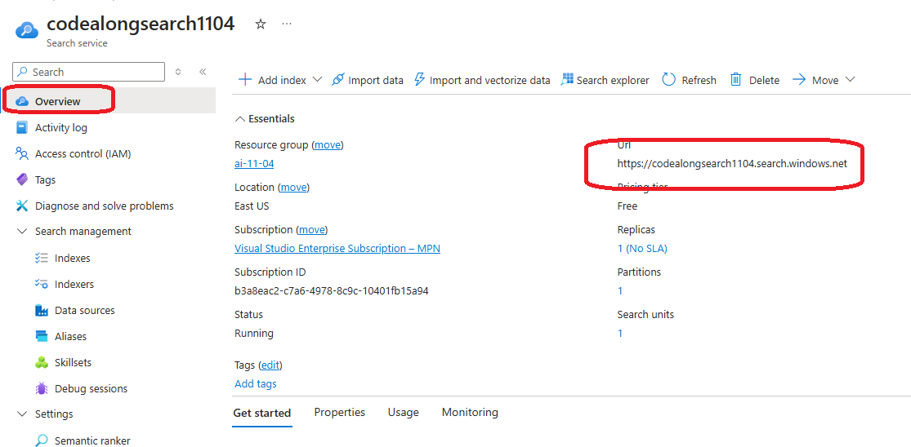
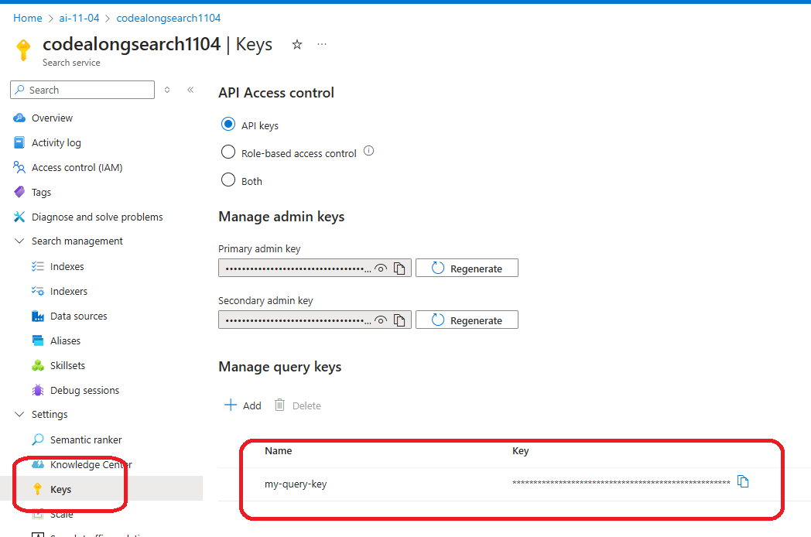
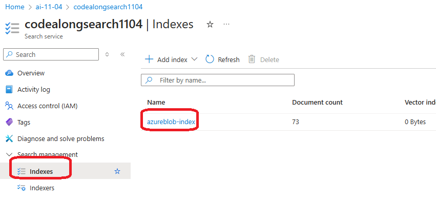
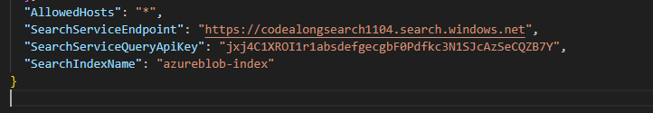

# Run the sample code


In the `code` folder is an ASP.Net Razor Pages application that exposes a web pages that uses Azure Search to create a search experience.


## Clone the repository

`git clone https://github.com/dgusoff/knowledge-mining-code-along.git`


## Enter the `code` directry

`cd code`

## update the app settings

find the file `appsettings.json`. Edit it to add the following properties form the Azure search Service:
* search service endpoint
* search service API key
* index name










## build the app

```
dotnet restore
dotnet build
```

## run the app

`dotnet run`


