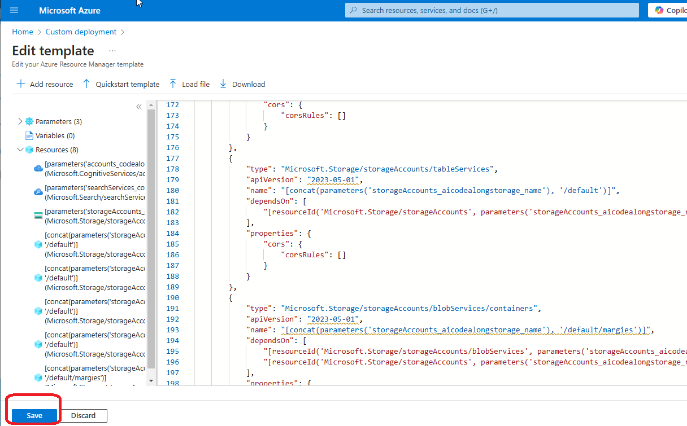
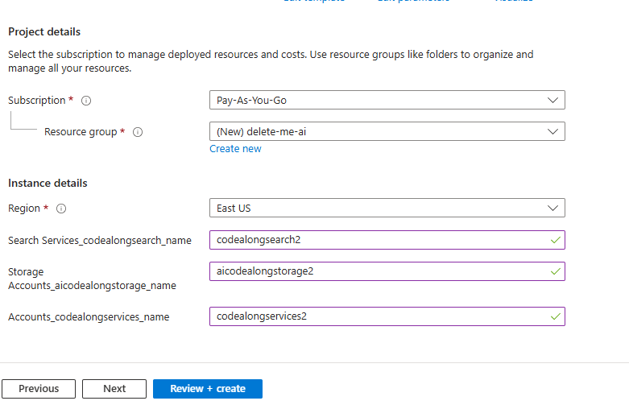
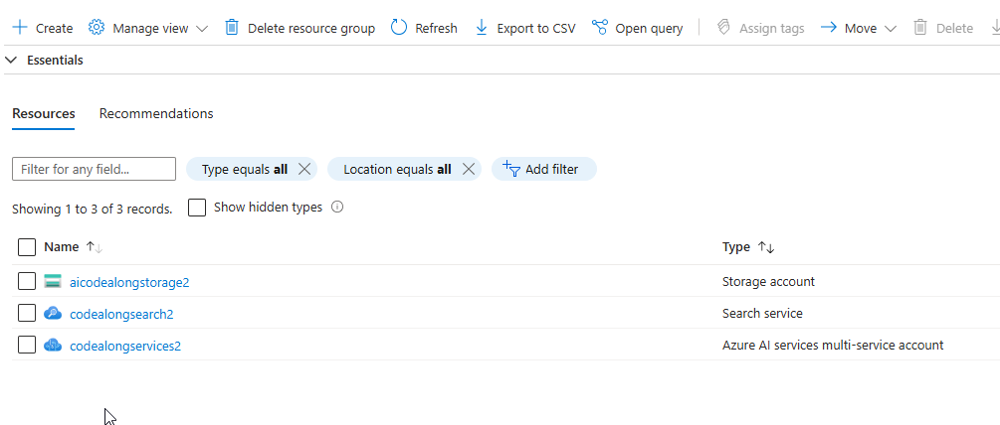
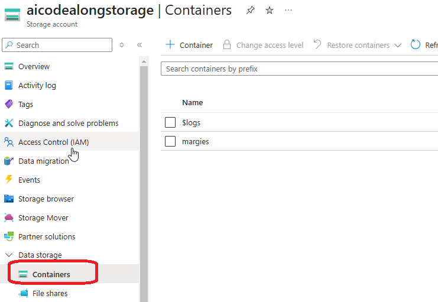

# Azure Environment Setup

## If you're provisioning your own Azure resources

1. In the Azure Portal, search for " Deploy a Custom Template"

2. Select "Build your own template in the editor"

3. Paste in the contents of template.json and click "Save"

4. Modify the parameters to your liking. You may get a validation error that an existing name is already taken. Change that if neccesary. Create a new resource group or select an existing one. Then click "Review and Create"

5. Once the deployment completes you should have three resources in your resource group

6. Make sure the search service is in the Free tier

7. Upload blob data to storage account

You'll need to populate your storage account with data. To do that we'll run a script using the Azure CLI. This script lives inside the `Data` folder along with the source documents.

Open the `uploadfiles.cmd` file. Replace the dummy values for subscription id, strage account name, and storage account key in the script.
 
 `cd` into the Data directory

 `az login` and select correct subscription

 `./uploadfiles.cmd`

 8. Verify blob data

 

## If you're using existing Azure resources

If you are using provised Azure resources you'll need to obtain and take note of the following for the code exercises:

* Storage account Name
* Storage account access key

