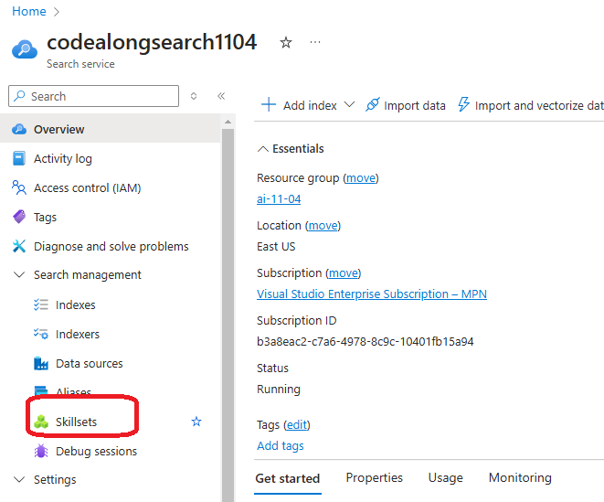
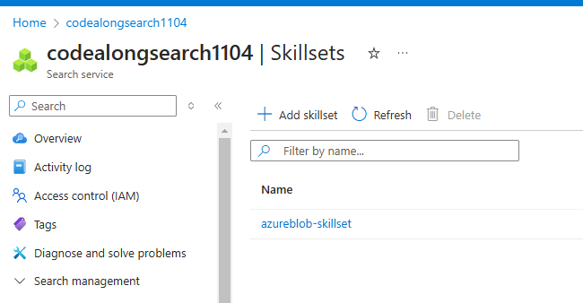
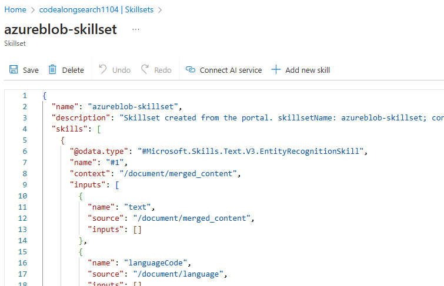
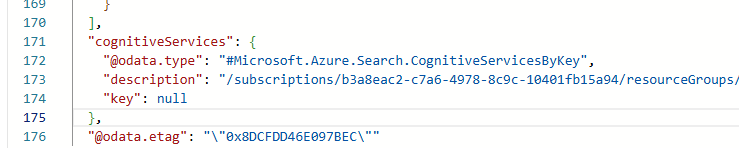
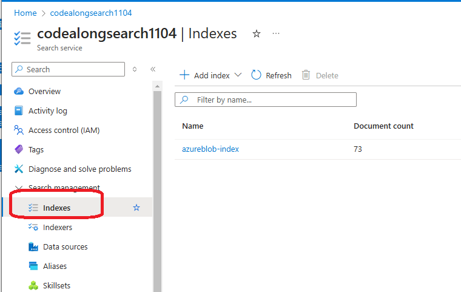
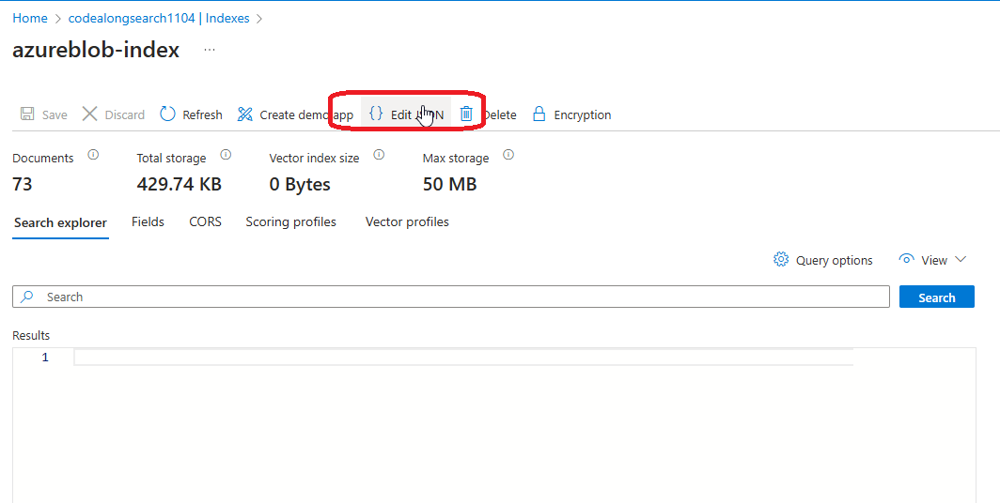
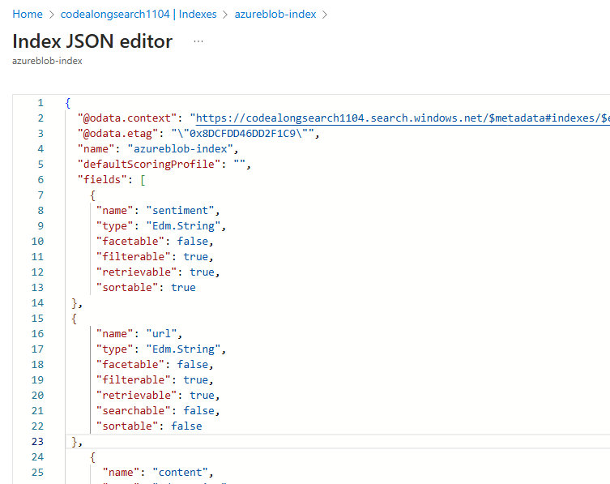
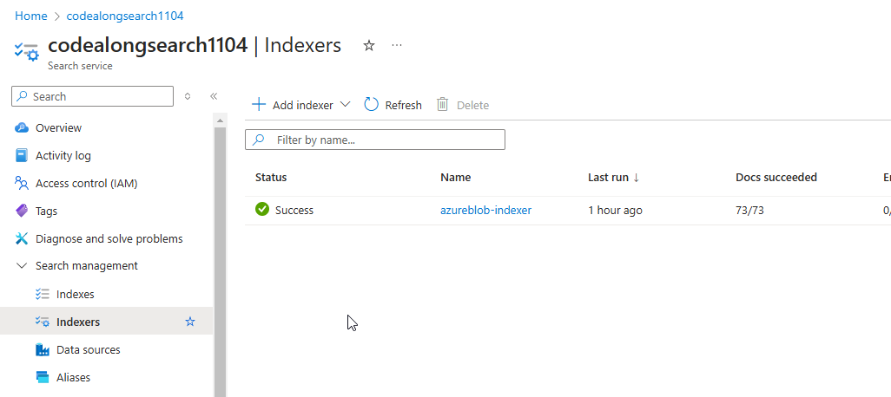
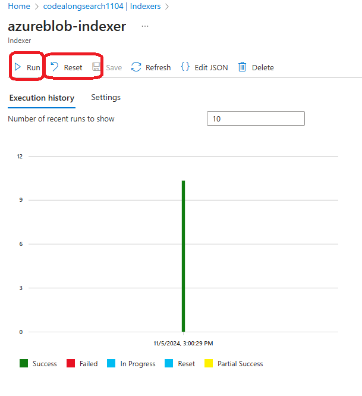
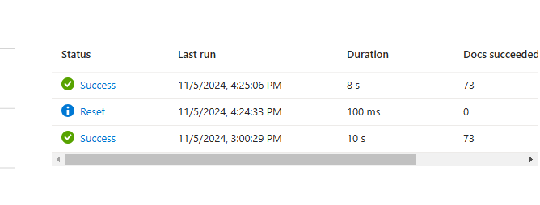

# modify indexes

Sometimes we will want to modify search indexes to add skills or indexing logic that are not available in teh portal editing experience. We will add skills to determine the sentiment of a document as well as add a new field to consume the URL of each document.

# Modify the Skillset







Note there skills defined int he JSON match the skills we set up in the data import.

Cognitive services key won't be surfaced here, it's a secret.




## add a new skill for sentiment analysis

```
{
     "@odata.type": "#Microsoft.Skills.Text.V3.SentimentSkill",
     "defaultLanguageCode": "en",
     "name": "get-sentiment",
     "description": "New skill to evaluate sentiment",
     "context": "/document",
     "inputs": [
         {
             "name": "text",
             "source": "/document/merged_content"
         },
         {
             "name": "languageCode",
             "source": "/document/language"
         }
     ],
     "outputs": [
         {
             "name": "sentiment",
             "targetName": "sentimentLabel"
         }
     ]
 }
```

# update the Index







## add the JSON to the index

```
{
     "name": "sentiment",
     "type": "Edm.String",
     "facetable": false,
     "filterable": true,
     "retrievable": true,
     "sortable": true
 },
 {
     "name": "url",
     "type": "Edm.String",
     "facetable": false,
     "filterable": true,
     "retrievable": true,
     "searchable": false,
     "sortable": false
 }
```



# update the indexer



## update field mappings

```
{
     "sourceFieldName" : "metadata_storage_path",
     "targetFieldName" : "url"
 }    
```

## update output field mappings

```
 {
     "sourceFieldName": "/document/sentimentLabel",
     "targetFieldName": "sentiment"
 }
```

Save the indexer. Then, reset and then run the index





## now run some more queries

```
 {
   "search": "London",
   "select": "url,sentiment,keyphrases",
   "filter": "metadata_author eq 'Reviewer' and sentiment eq 'positive'"
 }
```